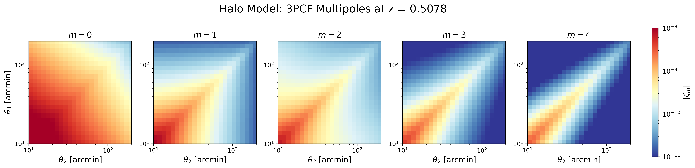
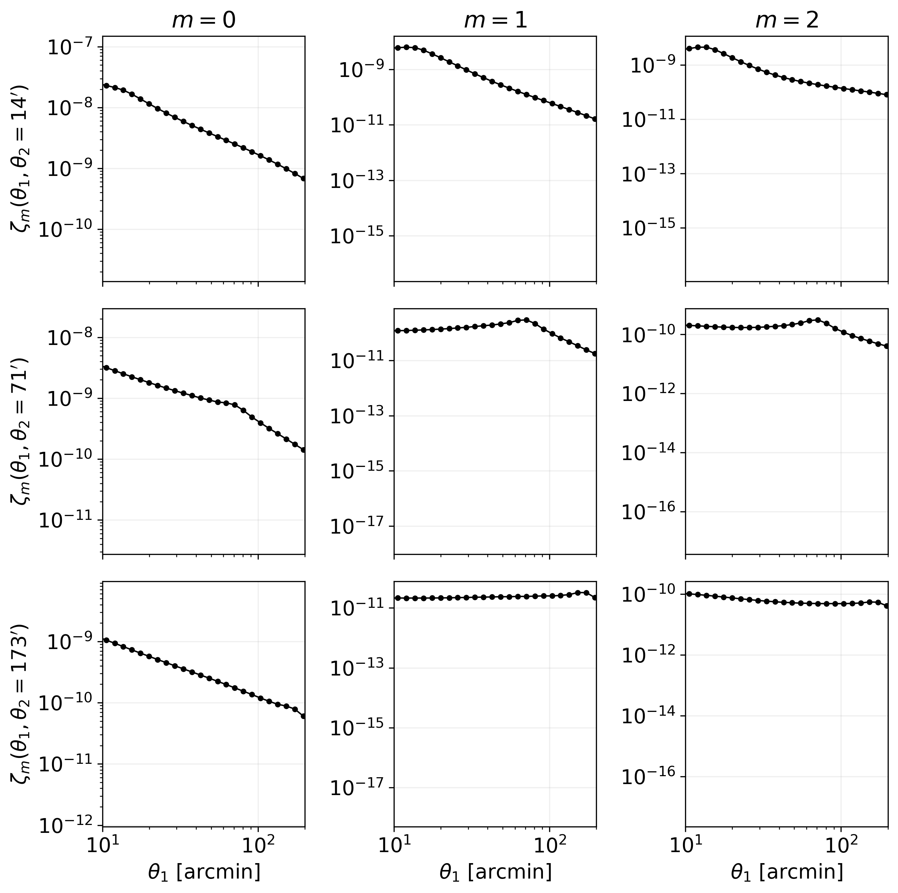
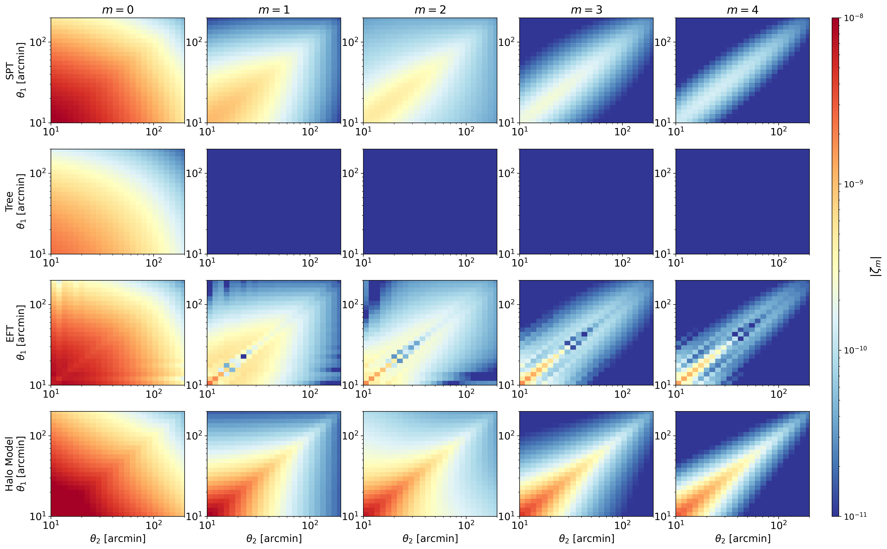

Python and 3PCF Tutorial
========================

This section provides a practical example of how to use **3ptWL-mod** from a
Python notebook. The example follows a complete workflow:

1. Generate a linear matter power spectrum using CAMB.
2. Run ``wlcf`` through the Python wrapper.
3. Plot the resulting 3-point correlation function multipoles.
4. Compare different theoretical models.

The notebook associated with this tutorial can be used as a starting point
for interactive runs and parameter exploration.  For a shorter workflow that
does not require a repository checkout or CAMB, begin with the standalone
:doc:`colab-four-models` notebook.

Setting up the working directory
--------------------------------

First, import the required Python packages and move to the ``tests`` directory
of the repository:

.. code-block:: python

    import os
    import numpy as np
    import matplotlib.pyplot as plt

    import camb
    from camb import model
    from wlcfpy import wlcf

    WLCF_TESTS_DIR = os.environ.get("WLCF_TESTS_DIR", "/path/to/3ptWL-mod/tests")
    os.chdir(WLCF_TESTS_DIR)

    os.makedirs("input", exist_ok=True)
    os.makedirs("Output", exist_ok=True)

Generating the linear power spectrum
------------------------------------

The linear matter power spectrum can be generated with CAMB. In this example
we use a T17-like cosmology at redshift :math:`z = 0.5078`:

.. code-block:: python

    def make_camb_linear_pk(
        output_file="./input/linear_pk_camb_T17_z05078.txt",
        z_pk=0.5078,
        h=0.7,
        Omb=0.046,
        Omc=0.233,
        Omnu=0.0,
        ns=0.97,
        sigma8=0.82,
        w0=-1.0,
        kmin=1e-4,
        kmax=50.0,
        npoints=1000,
    ):

        os.makedirs(os.path.dirname(output_file), exist_ok=True)

        H0 = 100.0 * h
        ombh2 = Omb * h**2
        omch2 = Omc * h**2

        pars = camb.CAMBparams()

        # For now we assume massless neutrinos, consistent with Omnu = 0.
        pars.set_cosmology(
            H0=H0,
            ombh2=ombh2,
            omch2=omch2,
        )

        pars.InitPower.set_params(
            ns=ns,
            As=2.1e-9
        )

        pars.set_dark_energy(w=w0)

        # Linear power spectrum at the same redshift used by wlcf/zbin
        pars.set_matter_power(
            redshifts=[z_pk],
            kmax=kmax
        )

        pars.NonLinear = model.NonLinear_none

        # First run to compute sigma8 for the trial As
        results = camb.get_results(pars)
        sigma8_current = results.get_sigma8()[0]

        # Rescale As so that CAMB matches the requested sigma8
        As_rescaled = 2.1e-9 * (sigma8 / sigma8_current) ** 2

        pars.InitPower.set_params(
            ns=ns,
            As=As_rescaled
        )

        results = camb.get_results(pars)

        kh, redshifts, pk = results.get_matter_power_spectrum(
            minkh=kmin,
            maxkh=kmax,
            npoints=npoints,
        )

        pk_z = pk[0]

        np.savetxt(
            output_file,
            np.column_stack([kh, pk_z]),
            fmt="%.10e"
        )

        print(f"Saved linear P(k) at z={z_pk} to:")
        print(output_file)
        print(f"sigma8 target  = {sigma8}")
        print(f"sigma8 CAMB    = {results.get_sigma8()[0]:.6f}")
        print(f"As rescaled    = {As_rescaled:.6e}")

        return output_file, kh, pk_z

The resulting file is passed to ``wlcf`` through the parameter ``fnamePS``.

Running 3ptWL-mod from Python
-----------------------------

The code can be executed directly from Python using the ``wlcfpy`` wrapper:

.. code-block:: python

    w = wlcf()
    w.set(
        numberThreads=8,
        verbose=2,
        verbose_log=1,

        z=0.5078,
        h=0.7,
        sigma8=0.82,
        Omb=0.046,
        Omc=0.233,
        Omnu=0.0,
        ns=0.97,
        w=-1.0,

        fnamePS="./input/linear_pk_camb_T17_z05078.txt",
        Wg=0,
        fWgchi="./input/Wg_Takahashi_z05078.txt",

        rootDir="Output",
        prefix="halo_model_z05078_",

        tree_level=4,
        zbin=0.5078,
        mMax=5,
        chiQuadSteps=300,
        GLpoints=64,
        Nell=128,
        ellmax=10000,
        ellmin=0.001,
        writevectors=0,
        options=""
    )

    w.Run()

Here ``tree_level=4`` selects the Takahashi/Halo-model branch.

Plotting the 3PCF multipoles
----------------------------

The output files ``zetam*.txt`` contain the multipoles
:math:`\zeta_m(\theta_1,\theta_2)`. These can be visualized as 2D maps:

.. code-block:: python

    import numpy as np
    import matplotlib.pyplot as plt
    from matplotlib.colors import LogNorm

    path = "Output"
    prefix = "halo_model_z05078_"

    theta = np.loadtxt(f"{path}/{prefix}theta_array.txt") * 180 / np.pi * 60
    Theta2, Theta1 = np.meshgrid(theta, theta)

    fig = plt.figure(figsize=(19, 4))

    gs = fig.add_gridspec(
        nrows=1,
        ncols=6,
        width_ratios=[1, 1, 1, 1, 1, 0.06],
        wspace=0.25
    )

    norm = LogNorm(vmin=1e-11, vmax=1e-8)

    for m in range(5):
        ax = fig.add_subplot(gs[0, m])

        zeta = np.abs(np.loadtxt(f"{path}/{prefix}zetam{m}.txt"))

        im = ax.pcolormesh(
            Theta2,
            Theta1,
            zeta,
            shading="auto",
            cmap="RdYlBu_r",
            norm=norm
        )

        ax.set_xscale("log")
        ax.set_yscale("log")
        ax.set_xlim(10, 200)
        ax.set_ylim(10, 200)
        ax.set_aspect("equal", adjustable="box")
        ax.set_title(fr"$m={m}$", fontsize=14)

        if m == 0:
            ax.set_ylabel(r"$\theta_1$ [arcmin]", fontsize=13)

        ax.set_xlabel(r"$\theta_2$ [arcmin]", fontsize=13)

    # Colorbar outside the plots
    cax = fig.add_subplot(gs[0, -1])
    cbar = fig.colorbar(im, cax=cax)
    cbar.set_label(r"$|\zeta_m|$", fontsize=13)
    cbar.ax.tick_params(labelsize=11)

    fig.suptitle(
        "Halo Model: 3PCF Multipoles at z = 0.5078",
        fontsize=18,
        y=1.02
    )
    plt.savefig("halo_model_3pcf.png", dpi=300, bbox_inches="tight")
    plt.show()

Or we can plot

.. code-block:: python

    path = "Output"
    prefix = "halo_model_z05078_"

    theta = np.loadtxt(f"{path}/{prefix}theta_array.txt") * 180/np.pi * 60

    theta2_targets = [13, 72, 169]
    m_values = [0, 1, 2]

    fig, axes = plt.subplots(
        len(theta2_targets),
        len(m_values),
        figsize=(9, 9),
        sharex=True
    )

    for i, theta2_fixed in enumerate(theta2_targets):
        idx = np.argmin(np.abs(theta - theta2_fixed))
        theta2_actual = theta[idx]

        for j, m in enumerate(m_values):
            ax = axes[i, j]

            zeta = np.abs(np.loadtxt(f"{path}/{prefix}zetam{m}.txt"))

            # theta2 fixed, theta1 varies
            y = zeta[:, idx]

            ax.plot(theta, y, color="black", marker="o", markersize=3, lw=1)

            ax.set_xscale("log")
            ax.set_yscale("log")

            ax.set_xlim(10, 200)

            if i == 0:
                ax.set_title(fr"$m={m}$")

            if j == 0:
                ax.set_ylabel(
                    fr"$\zeta_m(\theta_1,\theta_2={theta2_actual:.0f}')$"
                )

            if i == len(theta2_targets) - 1:
                ax.set_xlabel(r"$\theta_1$ [arcmin]")

            ax.grid(alpha=0.2)

    plt.tight_layout()
    plt.savefig("halo_model_slice_3pcf.png", dpi=300, bbox_inches="tight")
    plt.show()

Comparing different models
--------------------------

We can run several theoretical models by changing
``tree_level``:

.. code-block:: python

    base_params = dict(
        numberThreads=8,
        verbose=2,
        verbose_log=1,

        # T17 / paper cosmology
        z=0.5078,
        h=0.7,
        sigma8=0.82,
        Omb=0.046,
        Omc=0.233,
        Omnu=0.0,
        ns=0.97,
        w=-1.0,

        # Make sure this P(k) was generated with the same cosmology
        fnamePS="./input/linear_pk_camb_T17_z05078.txt",

        # Redshift bin
        Wg=0,
        fWgchi="./input/Wg_Takahashi_z05078.txt",

        rootDir="Output",

        zbin=0.5078,
        mMax=5,
        chiQuadSteps=300,
        GLpoints=64,
        Nell=128,
        ellmax=10000,
        ellmin=0.001,
        writevectors=0,
        options=""
    )

    models = {
        1: ("SPT", "spt"),
        2: ("Tree", "tree"),
        3: ("EFT", "eft"),
        4: ("Halo Model", "halo_model"),
    }

    for tree_level, (model_name, prefix_name) in models.items():

        print(f"Running {model_name} model with tree_level={tree_level}")

        params = base_params.copy()
        params["tree_level"] = tree_level
        params["prefix"] = f"{prefix_name}_z05078_"

        w = wlcf()
        w.set(params)
        w.Run()

        print(f"Finished {model_name}")

We plot the different cases

.. code-block:: python

    plt.rcParams.update({
        "font.size": 14,
        "axes.titlesize": 16,
        "axes.labelsize": 14
    })

    path = "Output"

    models = {
        "SPT": "spt_z05078_",
        "Tree": "tree_z05078_",
        "EFT": "eft_z05078_",
        "Halo Model": "halo_model_z05078_",
    }

    m_values = range(5)

    theta = np.loadtxt(f"{path}/{models['SPT']}theta_array.txt") * 180 / np.pi * 60
    Theta2, Theta1 = np.meshgrid(theta, theta)

    nrows = len(models)
    ncols = len(m_values)

    fig = plt.figure(figsize=(20, 13))

    gs = fig.add_gridspec(
        nrows=nrows,
        ncols=ncols + 1,
        width_ratios=[1, 1, 1, 1, 1, 0.05],
        wspace=0.2,
        hspace=0.25
    )

    norm = LogNorm(vmin=1e-11, vmax=1e-8)

    for i, (model_name, prefix) in enumerate(models.items()):
        for j, m in enumerate(m_values):

            ax = fig.add_subplot(gs[i, j])

            zeta = np.abs(np.loadtxt(f"{path}/{prefix}zetam{m}.txt"))

            im = ax.pcolormesh(
                Theta2,
                Theta1,
                zeta,
                shading="auto",
                cmap="RdYlBu_r",
                norm=norm
            )

            ax.set_xscale("log")
            ax.set_yscale("log")
            ax.set_xlim(10, 200)
            ax.set_ylim(10, 200)

            if i == 0:
                ax.set_title(fr"$m={m}$")

            if j == 0:
                ax.set_ylabel(f"{model_name}\n" + r"$\theta_1$ [arcmin]")

            if i == nrows - 1:
                ax.set_xlabel(r"$\theta_2$ [arcmin]")

    cax = fig.add_subplot(gs[:, -1])
    cbar = fig.colorbar(im, cax=cax)
    cbar.set_label(r"$|\zeta_m|$", fontsize=16)
    cbar.ax.tick_params(labelsize=12)
    plt.savefig("models_3pcf.png", dpi=300, bbox_inches="tight")
    plt.show()

The :doc:`colab-four-models` notebook packages this comparison into a
standalone, directly executable workflow and also adds one-dimensional model
slices.

Emulator and MCMC notebooks
---------------------------

The repository also includes a compact emulator workflow under ``tests/``.
The emulator is trained from 3ptWL-mod outputs, so users can regenerate the full
data set instead of relying on precomputed development files.

Run the notebooks in this order:

1. ``tests/emulator.ipynb``

   - builds a 300-point Latin-hypercube grid in ``Omega_m``, ``h``, and
     ``logAs``;
   - generates CAMB linear power spectra;
   - runs 3ptWL-mod for the zs9 redshift configuration;
   - trains one neural-network emulator per multipole and saves the weights
     under ``tests/emulator_outputs/``.

2. ``tests/use_wlcf_emulator.ipynb``

   - loads the weights generated by the first notebook;
   - shows how to evaluate the emulator;
   - selects a random test-set cosmology;
   - builds a simple artificial covariance;
   - runs a short ``emcee`` fit and saves a triangular plot under
     ``tests/emulator_usage_demo/``.

3. ``tests/firecrown_emulator_likelihood.ipynb``

   - loads the same emulator weights;
   - builds a masked 3ptWL-mod data vector with the new binning mask;
   - constructs a Gaussian likelihood with an artificial covariance;
   - runs a compact ``emcee`` check;
   - includes an optional Firecrown ``Statistic`` and ``ConstGaussian``
     scaffold that can be activated after installing Firecrown.

The implementation shared by these notebooks lives in
``tests/emulator.py``. Edit ``EmulatorConfig`` in that file, or override it
inside the notebook, to change the parameter ranges, number of evaluations,
network architecture, number of MCMC walkers, or number of MCMC steps.

The Firecrown bridge is optional. If it is needed, install Firecrown and SACC
from ``conda-forge`` in the notebook environment:

.. code-block:: bash

    conda create -n 3ptwl-mod-firecrown -c conda-forge \
      python=3.11 camb scipy scikit-learn matplotlib emcee corner \
      firecrown sacc jupyterlab ipykernel
    conda activate 3ptwl-mod-firecrown
    python -m ipykernel install --user --name 3ptwl-mod-firecrown \
      --display-name "Python (3ptWL-mod Firecrown)"
